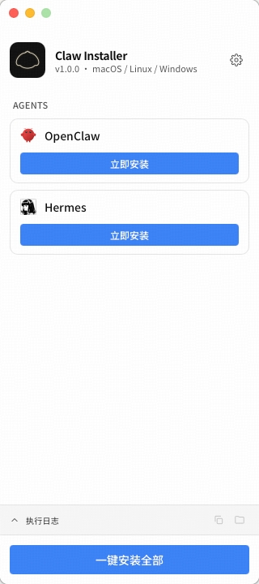
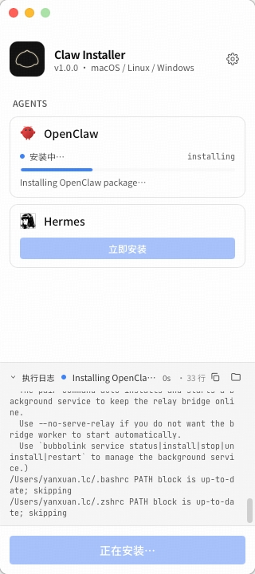
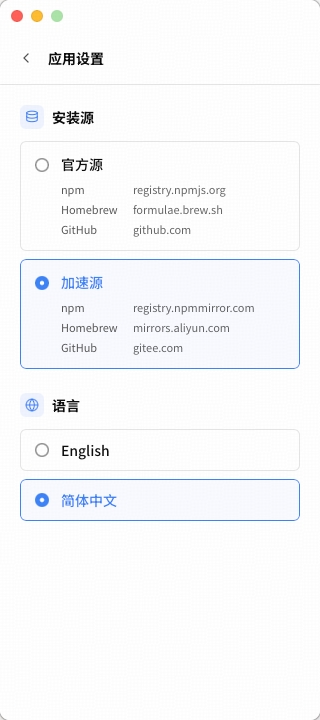
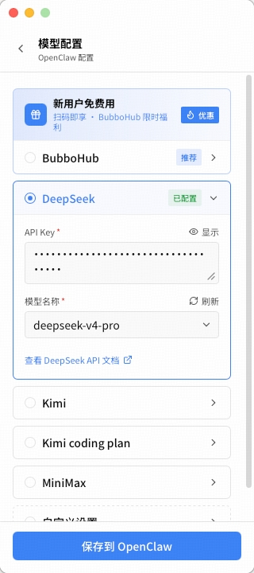
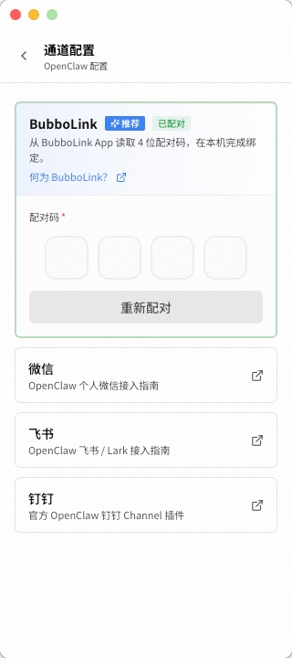

<!-- TODO: hero banner / logo SVG goes here once we have one -->

# Claw Installer

[English](./README.md) · **简体中文**

[](./LICENSE)
[](https://github.com/cylingo-group/claw-installer/releases/latest)
[](#下载)

**5 分钟，把你的 AI Agent 装好，任何系统都行。**

Claw Installer 是一款一键桌面安装器，专为「拿到一台新电脑就想立刻用上
OpenClaw + Hermes」的场景设计 —— 不用打开终端，不用手动折腾 Node / pnpm /
Python 这些前置依赖。挑好想装的 Agent，点一下「安装」，剩下的我们替你搞定。
macOS、Linux 和 Windows（通过 WSL 2）走的是同一条流程。

<!-- TODO: hero GIF or screenshot of the installer running (1100×620, ≤ 4 MB) -->

> 由 **心言集团 (Cylingo Group)** 出品 —— 也是 [**BubboLink**](https://bubbolink.com)
> 的研发团队。BubboLink 是一款 IM 侧网关，让你在一个聊天会话里同时调度
> 本机所有 Agent。装完之后在安装器内一键配对即可，无需再手动配置。

## 下载

挑选你的平台，从 [releases](https://github.com/cylingo-group/claw-installer/releases/latest)
获取最新版本。

| 平台                                      | 推荐安装包                                    | 其他选择                                       |
| --------------------------------------- | ---------------------------------------- | ------------------------------------------ |
| **macOS**（11+，Apple Silicon / Intel 通用） | `Claw-Installer-<version>-universal.dmg` | —                                          |
| **Windows** 10 / 11                     | `claw-installer-windows.zip`             | —                                          |
| **Linux**（Ubuntu / Debian）              | `Claw-Installer-<version>-amd64.deb`     | `Claw-Installer-<version>-x86_64.AppImage` |

**macOS** —— 打开 DMG，把 **Claw Installer** 拖到 `/Applications`，然后启动。

**Windows** —— 解压后双击 `claw-installer.exe`。首次运行系统会弹 UAC，请求
为你安装 WSL 2 + Ubuntu。允许它，必要时根据提示重启，重启后再次启动安装器即可。

**Linux**

```bash
sudo apt install ./Claw-Installer-<version>-amd64.deb
# 或者用便携版：
chmod +x Claw-Installer-<version>-x86_64.AppImage
./Claw-Installer-<version>-x86_64.AppImage
```

习惯命令行？也可以完全跳过 GUI：

```bash
git clone https://github.com/cylingo-group/claw-installer.git
cd claw-installer
./shell/install.sh                          # 同时安装两个 Agent
INSTALLER_AGENTS=openclaw ./shell/install.sh   # 只装其中一个
```

## 截图

<table>
  <tr>
    <td width="20%" align="center">
      <br>
      <sub><em>挑选要装的 Agent —— 单装或者一键全装。</em></sub>
    </td>
    <td width="20%" align="center">
      <br>
      <sub><em>安装进度一目了然，下方日志条实时同步。</em></sub>
    </td>
    <td width="20%" align="center">
      <br>
      <sub><em>设置里随时切换安装源和界面语言。</em></sub>
    </td>
    <td width="20%" align="center">
      <br>
      <sub><em>挑选模型 Provider —— BubboHub、DeepSeek、Kimi、MiniMax，或任意 OpenAI 兼容接入。</em></sub>
    </td>
    <td width="20%" align="center">
      <br>
      <sub><em>一键配对 BubboLink，或打开微信 / 飞书 / 钉钉接入文档。</em></sub>
    </td>
  </tr>
</table>

## 装了些什么

| 组件               | 它为你做了什么                                                                                   |
| ---------------- | ----------------------------------------------------------------------------------------- |
| **OpenClaw**     | 开源 Agent 运行时，驱动会话式工作流。工作区目录在 `~/.openclaw/`。                                              |
| **Hermes**       | 心言集团托管的模型桥。让本机所有 Agent 共享统一的 Provider 配置（BubboHub / DeepSeek / MiniMax / 任意 OpenAI 兼容接入）。 |
| **BubboLink 配对** | 把 BubboLink 手机 App 上的 4 位配对码粘进来即可绑定本机的全部 Agent。                                           |
| **接入文档**         | 一键打开 OpenClaw 的微信 / 飞书 / 钉钉接入指南，浏览器内直接看，免去手动配置。                                           |

底层会顺带帮你安顿好这些 Agent 依赖的运行时：**Node**（通过
[`fnm`](https://github.com/Schniz/fnm) 管理）、**pnpm**（通过 Corepack）、
**uv** 与 **Python 3.11**，外加一些系统工具（`curl`、`git`、`ripgrep`、
`ffmpeg`、构建链）。如果你机器上本来就有，我们不动你的（详见下文
[隐私说明](#隐私与对你电脑做了什么)）。

## 为什么用 claw-installer

如果不用安装器，在一台新电脑上同时跑起 OpenClaw 和 Hermes，大概要这样做：

1. clone 两个不同的仓库
2. 装 Node、pnpm、uv、Python 3.11、Rust、Playwright……
3. 改 `~/.bashrc` / `~/.zshrc` 配 PATH
4. 翻三份接入文档拼出正确的环境变量
5. 把两个 gateway 各自注册成系统服务
6. 祈祷不要和已有环境冲突

用 Claw Installer，则是这样：

1. 下载、点击、等几分钟

此外还有一些好处：

- **可重入。** 在已经装过一半的机器上重跑是安全的、也很快 —— 每一步都会
  先探测当前状态再决定要不要执行。
- **可逆。** 每一处副作用都被记录下来；`./shell/uninstall.sh` 会精确反向回滚，
  你机器上原本就有的东西不会被动到。
- **GUI 和 CLI 同源。** 桌面应用和 `./shell/install.sh` 跑的是同一条流水线 ——
  同事可以在 CI 或者通过 SSH 复现完全一致的安装。
- **网络友好。** 默认走国内镜像（npmmirror、Gitee），新机器首次安装不会卡在
  慢吞吞的官方源上。

## 系统要求

| 操作系统        | 版本                         | 磁盘        | 备注                                      |
| ----------- | -------------------------- | --------- | --------------------------------------- |
| **macOS**   | 11 Big Sur 及以上             | 约 3 GB 空闲 | Apple Silicon / Intel 都支持               |
| **Windows** | 10（1903+）/ 11              | 约 5 GB 空闲 | 需要 WSL 2（首次运行时安装器会替你配置）                 |
| **Linux**   | Ubuntu 20.04+ / Debian 11+ | 约 3 GB 空闲 | 其他发行版大概率能跑，但目前只对 Ubuntu / Debian 做过冒烟测试 |

安装期间需要联网。装完之后这些 Agent 本身可以离线运行（它们调模型 API 的
网络请求另说）。

## 隐私与对你电脑做了什么

我们觉得你应该清楚一个安装器到底会动你机器上的什么东西。下面是 Claw
Installer 涉及到的全部内容：

**写入的文件**

- `~/.openclaw/` —— OpenClaw 工作区与配置（`openclaw.json`，包含 gateway
  端口和一个随机生成的 32 字节鉴权 token）
- `~/.hermes/` —— Hermes 数据目录，其中包含 `~/.hermes/hermes-agent/` 这个
  浅克隆的代码仓库
- `~/.local/bin/hermes` —— Hermes 命令行入口
- `~/.npmrc` —— 一段有起止标记的「托管块」，把 npm/pnpm 指向
  `registry.npmmirror.com`。你 `.npmrc` 里的其他设置我们不动。
- `~/.bashrc` / `~/.zshrc` —— 一段托管块，把 `fnm` 和相关二进制加入 `PATH`。
  同样有起止标记，需要时可以干净移除。
- `~/.claw-installer/manifest.tsv` —— 我们每一步改动的结构化记录（卸载时会用到）

**下载的程序**

- OpenClaw 来自 `registry.npmmirror.com`（npm 镜像，可通过
  `INSTALLER_NPM_REGISTRY` 覆盖）
- Hermes 来自 `https://gitee.com/cylingo-group/hermes-agent`（HTTPS 浅克隆）
- `fnm`、Node、Python 3.11、`uv` 来自各自的官方分发渠道（GitHub Releases /
  `astral.sh`）
- 可选的 Playwright + Chromium（用 `INSTALLER_HERMES_SKIP_BROWSER=1` 跳过）

**注册的后台服务**

- 用户级 launchd（macOS）/ systemd（Linux）服务，托管 OpenClaw gateway，
  默认监听 `127.0.0.1:18789`（仅本机回环，不会暴露到局域网）
- Hermes 的 launchd / systemd 服务定义（仅注册不启动；配好凭证后从 GUI 启动）

**它不会做的事**

- 不上报。安装器不会回传任何数据 —— 不收集分析信息、不上报你的机器信息或
  使用情况。整个安装过程中的外联流量只有上面列出的那些下载请求。
- 不写系统级路径。所有东西都装在你自己的家目录下；只在 Linux 上、且系统
  工具（`curl`、`git`、`ripgrep`、`ffmpeg`、`build-essential`）确实缺失时，
  才会请求一次 `sudo` 来 `apt install` 它们。
- 不静默更新。除非你重新运行安装器，否则不会自己升级版本。

**干净卸载**

```bash
./shell/uninstall.sh             # 反向回滚我们装的所有东西；--dry-run 可预览
./shell/agents/openclaw/uninstall.sh    # 只卸载某个 Agent
```

卸载器读取 `~/.claw-installer/manifest.tsv`，所有标记为 `preexisting` 的条目
都会被跳过 —— 你机器上原本就有的目录或包不会被删。

## 常见问题

**会动我现有的 Node 或 Python 吗？**
不会。Node 是通过 `fnm` 装在用户级前缀目录里的；Python 3.11 是通过 `uv` 安装
的 —— 两者都不会修改你系统自带的 Node / Python。如果你已经装了 `fnm` / `uv`，
我们直接复用。

**需要 root / `sudo` 吗？**
macOS 和 Windows 都不需要。Linux 上如果系统工具（`curl`、`git`、`ripgrep`、
`ffmpeg`、`build-essential`）确实缺失，我们会请求一次 `sudo` 用于
`apt install` —— 仅此一处需要提权。

**为什么 Windows 要用 WSL？**
OpenClaw 和 Hermes 都是面向 POSIX 环境开发和测试的。让 Windows 用户跑在 WSL 2
里，可以和 Linux 用户走完全一致的代码路径，少踩一堆 Windows 专属的坑。
没有 WSL 的话，安装器在首次运行时会替你装好 WSL 2 + Ubuntu。

**能干净卸载吗？**
可以。`./shell/uninstall.sh` 按 manifest 反向回滚所有改动，对你机器上预先
存在的文件 / 包不动手。建议先 `--dry-run` 预览一下。

**会自动更新吗？**
不会。想升级就重新运行最新版安装器（或重跑 `./shell/install.sh`）。
重跑是幂等的 —— 已经安装的组件会被识别并跳过。

**公司有防火墙或代理怎么办？**
安装器遵循标准的 `HTTP_PROXY` / `HTTPS_PROXY` / `NO_PROXY` 环境变量。如果
你的网络封了 npmmirror 或 Gitee，可以用 `INSTALLER_NPM_REGISTRY=<你的镜像>`
和 `INSTALLER_HERMES_INSTALL_URL=<你的镜像>` 来覆盖。

**只装两个 Agent 中的一个可以吗？**
可以。GUI 里取消勾选不想装的那个即可。命令行：
`INSTALLER_AGENTS=openclaw ./shell/install.sh`（或者 `hermes`）。

**OpenClaw 的 gateway token 放在哪？会暴露到局域网吗？**
这个 32 字节的 token 是在本地生成的，存在 `~/.openclaw/openclaw.json`。
Gateway 默认绑在 `127.0.0.1:18789` —— 仅本机回环，局域网访问不到。可以用
`INSTALLER_GATEWAY_BIND` 改这个行为。

## 反馈渠道

- **发现 bug 或想提需求？** [来 GitHub 提 Issue](https://github.com/cylingo-group/claw-installer/issues) ——
  请带上你的操作系统、安装器版本，以及报错时屏幕上显示的最后一行。
- **想了解产品？** 欢迎访问 [bubbolink.com](https://bubbolink.com)。
- **想直接和我们聊聊？** <!-- TODO: Discord / 飞书 / 微信群入口 -->

## 技术栈

桌面端基于 [Tauri](https://tauri.app)（Rust + TypeScript），安装流水线是纯
Bash。代码采用 Apache-2.0 协议开源，由 [心言集团](https://bubbolink.com) 出品。

<details>
<summary><strong>从源码构建</strong>（面向贡献者）</summary>

环境要求：

- [pnpm](https://pnpm.io) ≥ 9
- [Rust](https://rustup.rs) stable 工具链
- 构建 **macOS universal**：`rustup target add x86_64-apple-darwin`
- **Windows 交叉编译**：`cargo install cargo-xwin`
- **在 macOS 上构建 Linux 包**：本机启动 Docker Desktop

构建命令：

```bash
make build-mac        # universal .app + .dmg → dist/macos/
make build-linux      # .deb + .AppImage → dist/linux/（基于 Docker，原生架构）
make build-windows    # claw-installer.exe + shell/ → dist/windows/*.zip
make build-all        # 顺序构建以上三个
```

> `make build-linux` 产出的是 Docker 容器原生架构的产物 —— Apple Silicon
> 主机出 arm64，Intel 主机出 amd64。需要跨架构构建时设
> `LINUX_PLATFORM=linux/amd64`（qemu 模拟下慢，约 2–3 小时）或
> `LINUX_PLATFORM=linux/arm64`。

开发环境运行：

```bash
make dev              # Tauri 开发模式 —— 含热更新 + Rust
make frontend         # 浏览器 stub 模式 —— 不启 Rust，不调 Agent IPC
```

安装器的内部细节（shell 脚本分层、manifest 格式、GUI ↔ shell 通信协议、
`INSTALLER_*` 环境变量、双流日志）会单独整理 —— 见 `docs/architecture.md`
（TODO），或直接以 `shell/install.sh`、`shell/lib/common.sh` 为准。

</details>

## 参与贡献

欢迎 PR。除小修小补外，请先开 issue 讨论一下方向。架构相关的细节后续会
整理到 `docs/architecture.md`。

## License

[Apache License 2.0](./LICENSE)。
